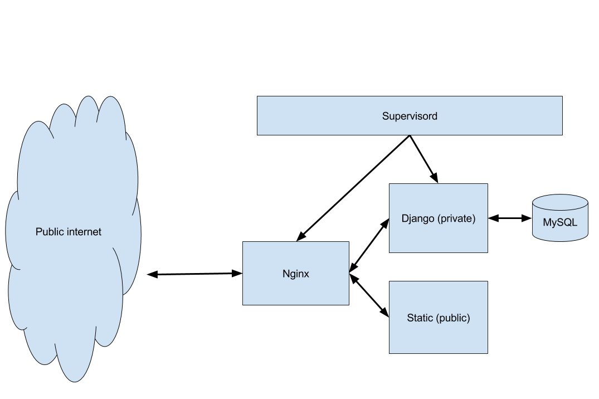

The website is primarily made up of 2 components: "public" and "private". They
are entirely separate websites that live under the `acm.byu.edu` domain.

### External Website
The public portion of the website is a simple static website. It's the area that
does not require login. All code for this is under `public/`. Updating the
public site will typically require modifying the HTML, CSS, or JavaScript found
in that folder. "Static" in this context implies that when users go to the
external website, all that happens is some HTML gets served up. There's no
database querying or any kind of backend logic.

### Internal Website
The private portion of the website is a [Django](https://www.djangoproject.com/)
app running under `acm.byu.edu/*`. Ideally this would (and should) run under a
subdomain i.e. app.acm.byu.edu. But that is a task for another day... Currently
the way that traffic is routed to the [Django](https://www.djangoproject.com/)
app is a (hacky) [Nginx](https://www.nginx.com/) configuration that looks like
the following:

```nginx
location ~ ^/(admin|accounts|dashboard|membership|problems)(/|$) {
  proxy_pass http://acm-django-server;
  proxy_redirect off;
}
```

So as you can see, any request to `acm.byu.edu` that uses `/admin`, `/accounts`,
`/dashboard`, etc. will get forward to the
[Django](https://www.djangoproject.com/) app. Anything else will go to the
external website.


### Architecture

Components:
- [Nginx](https://www.nginx.com/)
- Internal ([Django](https://www.djangoproject.com/))
- External (Static)
- Supervisord
- MySQL



Per the diagram, requests come in through [Nginx](https://www.nginx.com/), which
decides whether to route them to the internal or external website based on the
URL. The internal website uses MySQL as the database. Supervisord is a daemon
that monitors [Nginx](https://www.nginx.com/) and
[Django](https://www.djangoproject.com/). In the case that either crases,
Supervisord will restart it. More information about
[Nginx](https://www.nginx.com/), Supervisord,
[Django](https://www.djangoproject.com/), and MySQL can be found in
resources.md.

### Screenshots
External site (static):


Internal site ([Django](https://www.djangoproject.com/)/Python application):


