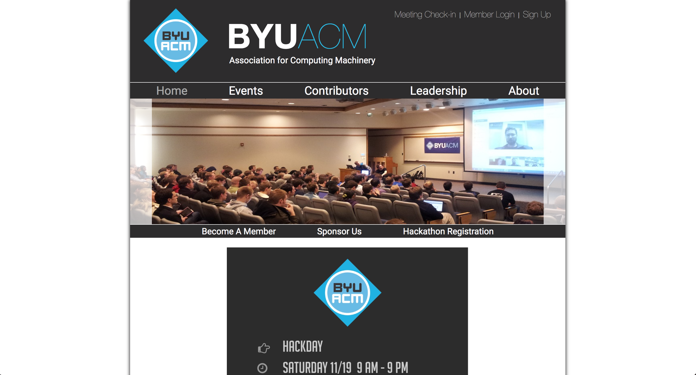
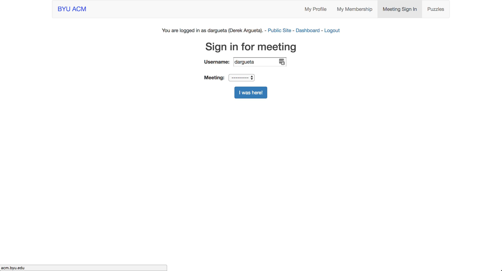

The website is primarily made up of 2 components: "public" and "private". They
are entirely separate websites that live under the `acm.byu.edu` domain.

The public portion of the website is a simple static website. It's the area that
does not require login. All code for this is under `public/`. Updating the
public site will typically require modifying the HTML, CSS, or JavaScript found
in that folder.

The private portion of the website is a Django app running under `acm.byu.edu/*`.
Ideally this would (and should) run under a subdomain i.e. app.acm.byu.edu. But
that is a task for another day... Currently the way that traffic is routed to
the Django app is a (hacky) Nginx configuration that looks like the following:

```nginx
location ~ ^/(admin|accounts|dashboard|membership|problems)(/|$) {
  proxy_pass http://acm-django-server;
  proxy_redirect off;
}
```

So as you can see, any request to `acm.byu.edu` that uses `/admin`, `/accounts`,
`/dashboard`, etc. will get forward to the Django app.

Public site (static):



Private site (Django/Python application):


